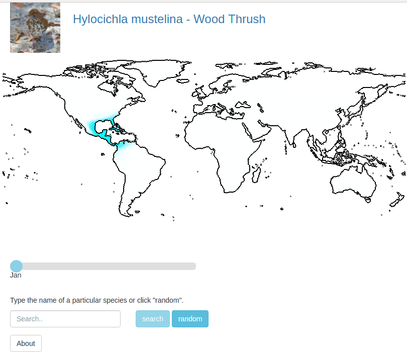

# Presence-Only Geographical Priors for Fine-Grained Image Classification - Web Viewer
Web-app to display predictions of our spatio-temporal model.   
1) Make sure the path to the trained model in `config.py` is correct.  
2) `application.py` assumes that the code for the model is in the parent directory.  

### Demo
If successful you can open your browser and see the following.  
<p align="center">
  
</p>


## Deploy Locally
Run `python application.py`  


## Deploy on AWS
Have at least t2.small instance.    
Make sure ports are open on AWS (in security groups).  

Use nginx to divert traffic from port 80.  
Instructions for nginx https://chrisdtran.com/2017/deploy-flask-on-ec2/  


#### Install dependencies
sudo apt-get update  
wget https://repo.anaconda.com/archive/Anaconda3-2019.07-Linux-x86_64.sh  
bash Anaconda3-2019.07-Linux-x86_64.sh     
export PATH="/home/ubuntu/anaconda2/bin:$PATH"  
sudo apt-get install unzip  
sudo apt-get install software-properties-common  
sudo apt-add-repository universe  
sudo apt-get update && sudo apt-get install python-pip  
conda install pytorch-cpu torchvision-cpu -c pytorch  
conda install gunicorn    
sudo apt-get install nginx  

#### Get code
wget PATH_TO_CODE/web_app.zip  
unzip web_app.zip  
cd web_app/  


#### Setup server
make sure flask app is running at 127.0.0.1:8000  
sudo rm /etc/nginx/sites-enabled/default  
sudo nano /etc/nginx/sites-available/example.com  
```
server {
	listen 80;

	location / {
		proxy_pass http://127.0.0.1:8000/;
	}
}
```

sudo ln -s /etc/nginx/sites-available/example.com /etc/nginx/sites-enabled/example.com  
sudo service nginx restart  


#### Launch app
screen gunicorn application:application  


## Deploy - AWS Elastic Beanstalk  
As of Mar 2019 I was having trouble installing PyTorch on elastic beanstalk. Maybe it's better now?   
