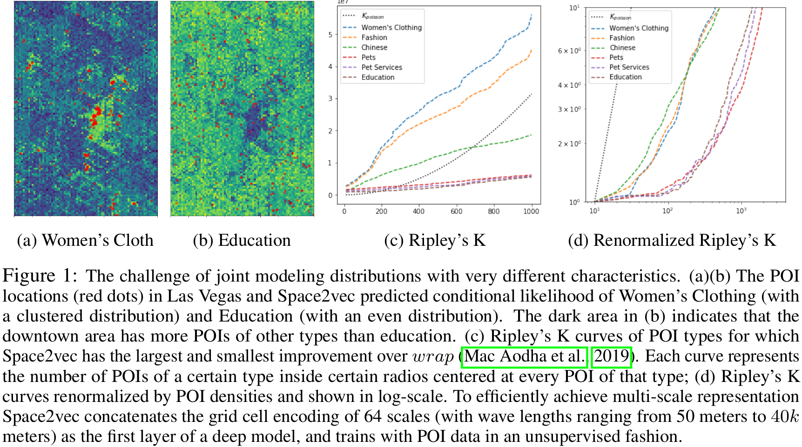
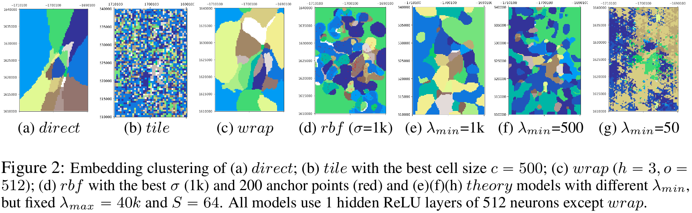
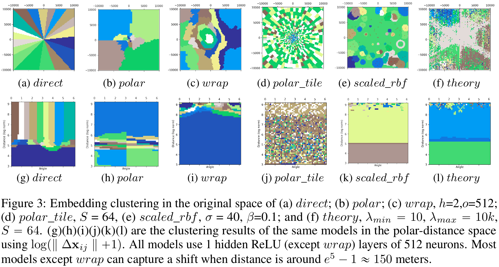

# Multi-Scale Representation Learning for Spatial Feature Distributions using Grid Cells
Code for recreating the results in our ICLR 2020 [paper](https://openreview.net/forum?id=rJljdh4KDH).

## Motivation
<p align="center">
  
</p>

This code contains two parts which are corresponding to two tasks in our paper:
## Point of Interest (POI) Type Classification Task
`spacegraph/` folder contains codes for recreating the evaluation results of POI type classification task: both location modeling and context modeling.

### Dependencies
- Python 2.7+
- Torch 1.0.1+
- Other required packages are summarized in `spacegraph/requirements.txt`.

### Data
You can find the POI type classification dataset in `spacegraph/data_collection/Place2Vec_center/`.

### Code Usage
All codes about the POI type classification task are in `spacegraph/spacegraph_codebase/`.

#### Location Modeling (See Section 5.1.1 and 5.1.2 in [our ICLR 2020 paper](https://openreview.net/forum?id=rJljdh4KDH))
You can train different models from different bash files in `spacegraph/`(See Appendix A.1 in [our ICLR 2020 paper](https://openreview.net/forum?id=rJljdh4KDH)):
1. `direct`: run `bash Place2Vec_2_enc_dec_global_naive.sh`.
2. `tile`: run `bash Place2Vec_2_enc_dec_global_gridlookup.sh`.
3. `wrap`: run `bash Place2Vec_2_enc_dec_global_aodha.sh`.
4. `rbf`: run `bash Place2Vec_2_enc_dec_global_rbf.sh`.
5. `gird`: run `bash Place2Vec_2_enc_dec_global_grid.sh`.
6. `theory`: run `bash Place2Vec_2_enc_dec_global_theory.sh`.

###### The Comparison Among the Response Maps of Different Models
<p align="center">
  
</p>

#### Spatial Context Modeling (See Section 5.1.3 in [our ICLR 2020 paper](https://openreview.net/forum?id=rJljdh4KDH))
You can train different models from different bash files in `spacegraph/`(See Appendix A.1 in [our ICLR 2020 paper](https://openreview.net/forum?id=rJljdh4KDH)):
1. `none`: run `bash Place2Vec_2_enc_dec_none.sh`.
2. `direct`: run `bash Place2Vec_2_enc_dec_naive.sh`.
3. `polar`: run `bash Place2Vec_2_enc_dec_polar.sh`.
4. `tile`: run `bash Place2Vec_2_enc_dec_gridlookup.sh`.
5. `polar_tile`: run `bash Place2Vec_2_enc_dec_polargridlookup.sh`.
6. `wrap`: run `bash Place2Vec_2_enc_dec_aodha.sh`.
7. `rbf`: run `bash Place2Vec_2_enc_dec_rbf.sh`.
8. `scaled_rbf`: run `bash Place2Vec_2_enc_dec_scaledrbf.sh`.
9. `gird`: run `bash Place2Vec_2_enc_dec_grid.sh`.
10. `theory`: run `bash Place2Vec_2_enc_dec_theory.sh`.

###### The Comparison Among the Response Maps of Different Models
<p align="center">
  
</p>

## Geo-Aware Fine-Grained Image Classification Task

`geo_prior/` folder contains codes for recreating the evaluation results of geo-aware fine-grained image classification task in our ICLR 2020 [paper](https://openreview.net/forum?id=rJljdh4KDH).

These codes are modified from [Mac Aodha et al.'s GitHub codebase](https://github.com/macaodha/geo_prior) in which we add multiple Space2Vec location encoder modules to capture the geographic priors information about images. 

### Dependencies
- Python 3.6+
- Torch 1.3.0+
- Other required packages are summarized in `geo_prior/requirements.txt`.


### Data
In order to obatin the data, please go to [Mac Aodha et al.'s project website](http://www.vision.caltech.edu/~macaodha/projects/geopriors/index.html).

### Code Usage
This code is implemented in Python 3
`geo_prior/geo_prior/` contains the main code for training and evaluating models (We use BirdSnap† dataset as an example):
1. `geo_prior/geo_prior/train_geo_net.py` is used to train the location encoder model. Run `python3 train_geo_net.py`. 
2. `geo_prior/geo_prior/run_evaluation.py` is used to evalute the location encoder model by combining the pretrained CNN features.  Run `python3 run_evaluation.py`. 


### Reference
If you find our work useful in your research please consider citing our paper.  
```
@inproceedings{space2vec_iclr2020,
	title={Multi-Scale Representation Learning for Spatial Feature Distributions using Grid Cells},
	author={Mai, Gengchen and Janowicz, Krzysztof and Yan, Bo and Zhu, Rui and  Cai, Ling and Lao, Ni},
	booktitle={The Eighth International Conference on Learning Representations},
	year={2020},
	organization={openreview}
}
```
If you want to use our code for image classification, please cite both [our ICLR 2020 paper](https://openreview.net/forum?id=rJljdh4KDH) and [Mac Aodha et al's ICCV paper](https://arxiv.org/abs/1906.05272):
```
@inproceedings{geo_priors_iccv19,
  title     = {{Presence-Only Geographical Priors for Fine-Grained Image Classification}},
  author    = {Mac Aodha, Oisin and Cole, Elijah and Perona, Pietro},
  booktitle = {ICCV},
  year = {2019}
}
```